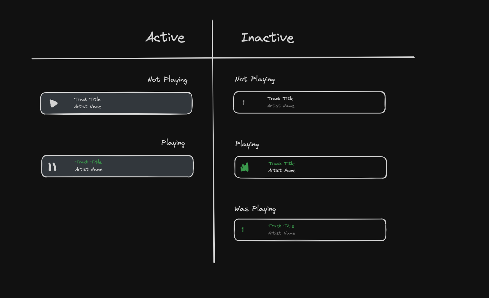

# Motify: A Fullstack Spotify Clone

## Overview
Motify is a full-stack, pixel-perfect clone of Spotify designed to emulate the core functionalities of the original platform with a responsive and intuitive user interface.

## Core Features
- **Hosting**: Application deployment on Render.
- **User Authentication**: Secure login, registration, and session management with demo account access.
- **Play Bar**: Interactive play bar for music playback and controls.
- **Playlist Management**: Comprehensive playlist management, including CRUD operations, song addition/removal, and custom playlist titles.
- **Search**: Real-time search across artists, songs, albums, and playlists.


<br>

## Installation and Setup
```
rails server
```

```
cd /frontend
npm run start
```

<br>

## Highlighted Features
### Dynamic Search
Dynamic real-time search fetching from Rails backend for Songs, Albums, Artists, and Playlists that match the search query.


```javascript
const SearchField = () => {
  const [inputValue, setInputValue] = useState('');
  const dispatch = useDispatch();
  const { error, results, searchInitiated, query } = useSelector(state => state.search);

  const handleChange = (event) => {
    const newQuery = event.target.value;
    setInputValue(newQuery);
    if (newQuery) {
      dispatch(performSearch(newQuery)); // Dispatching performSearch action with new query
    } else {
      dispatch(clearSearch()); // Clearing the search when input is empty
    }
  };

  const clearInput = () => {
    setInputValue('');
    dispatch(clearSearch()); // Dispatch Redux action to clear search
  };

  return (
    <>
      <div className='search-input-container'>
        
        <input
          type='text'
          placeholder='Search for songs or episodes'
          value={inputValue}
          onChange={handleChange}
        />
        
      </div>
      {error && <p>Error: {error.message}</p>}
      <SearchResultsDropdown query={query} searchResults={results} searchInitiated={searchInitiated}/>
    </>
  );
}

export default SearchField;
```

### SongsTable UI/UX with Redux State Management
Redux state management for globalized state enhancing user experience and user interface design. Song row style changes based on current song playing state.




## Future Features
- Enhanced user and artist profiles.
- Social features to follow and unfollow users and artists.
- Like/unlike functionality for songs, albums, and playlists.
- Dynamic playlist cover generation based on song selection.

<br>