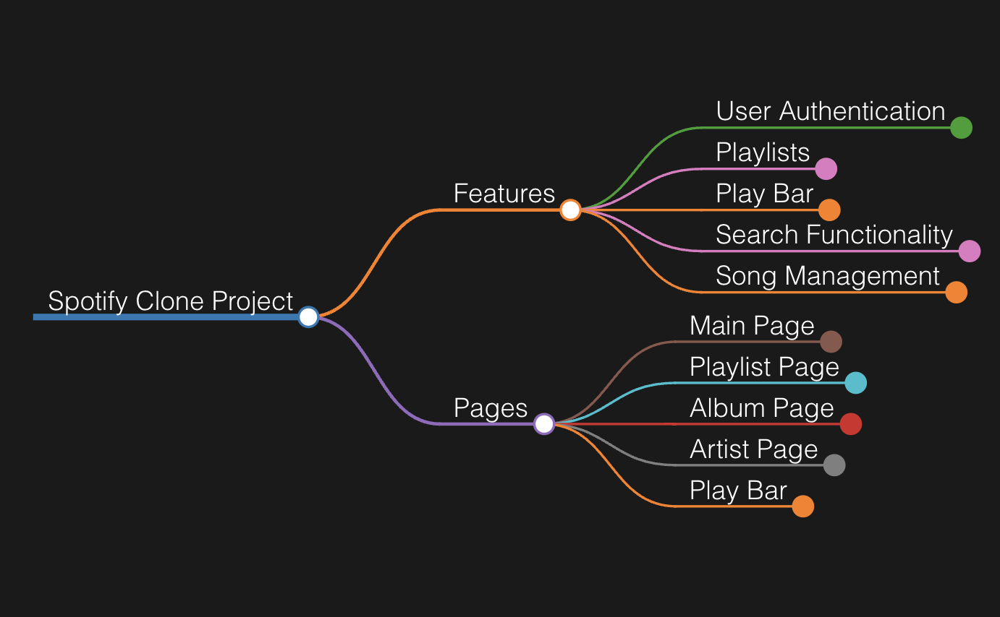

# Motify: A Fullstack Spotify Clone

## Overview
Motify is a full-stack, pixel-perfect clone of Spotify designed to emulate the core functionalities of the original platform with a responsive and intuitive user interface.

## Core Features
- **Hosting**: Application deployment on Render.
- **User Authentication**: Secure login, registration, and session management with demo account access.
- **Play Bar**: Interactive play bar for music playback and controls.
- **Playlist Management**: Comprehensive playlist management, including CRUD operations, song addition/removal, and custom playlist titles.
- **Search**: Real-time search across artists, songs, albums, and playlists.



<br>

## Installation and Setup
```
rails server
```

```
cd /frontend
npm run start
```

<br>

## Future Features
- Enhanced user and artist profiles.
- Social features to follow and unfollow users and artists.
- Like/unlike functionality for songs, albums, and playlists.
- Dynamic playlist cover generation based on song selection.

<br>