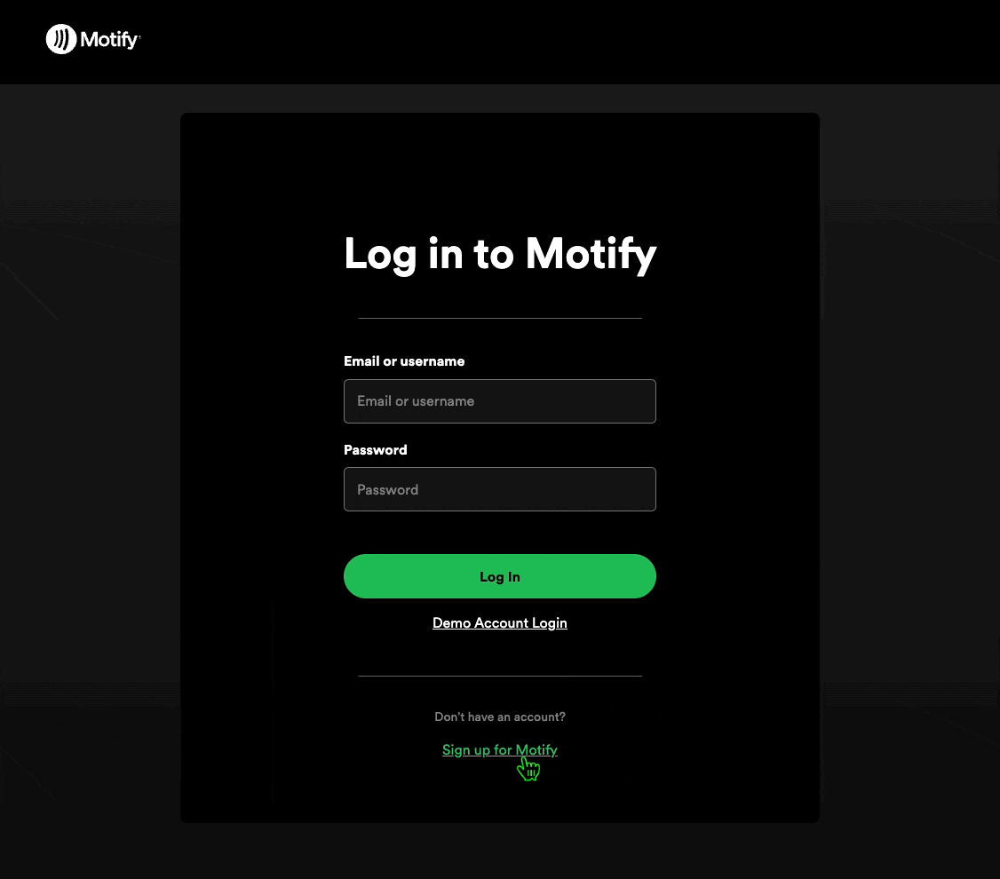
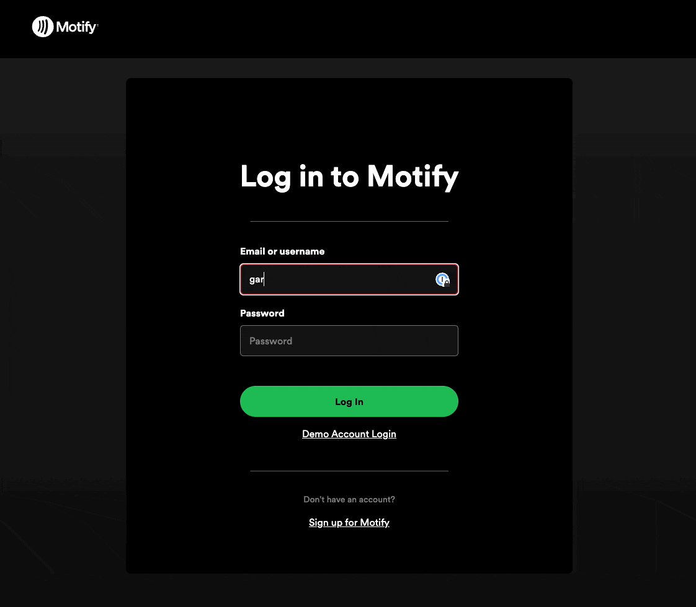

# Motify: A Fullstack Spotify Clone
Motify is a full-stack clone of Spotify designed to emulate the core functionalities of the original platform with a responsive and intuitive user interface.


## Core Features
-   **User Authentication**: 
  Secure login, registration, and session management with demo account access.
  
  
<br>

-   **Play Bar**: 
  Interactive play bar for music playback and controls.
<br>

-   **Playlist Management**: 
Comprehensive playlist management, including CRUD operations, song addition/removal, and custom playlist titles.
<br>

-   **Dynamic Search**: 
Real-time search across artists, songs, albums, and playlists.

<br>

-   **Hosting**: 
Application deployment on Render.


## Data Architecture & Tech Stack

The Motify application employs a modern full-stack architecture:
- React.js
- Ruby on Rails with PostgreSQL
- Redux
- Node.js
- HTML, CSS, Vanilla JavaScript

The front end is built with React, leveraging HTML, CSS, and JavaScript to deliver a responsive user interface and user experience. State management within the front end is handled by Redux, which serves as a predictable state container, interfacing with middleware for asynchronous events.

Routing is managed through a combination of React for component rendering and Node.js for server-side logic, facilitating the navigation within the application.

The backend is powered by Ruby on Rails, providing a robust server-side framework. Data persistence is achieved with PostgreSQL, a powerful object-relational database system. The data serialization is handled by jBuilder, allowing for the creation of JSON structures that are consumed by the front end.

This architecture supports a scalable, maintainable, and interactive web application, designed for optimal user engagement and straightforward data flow from the database to the end user.

## UI/UX Design Philosophy
Spotify's design philosophy revolves around ;


## Highlighted Features

### Dynamic Search
Dynamic real-time search fetching from Rails backend for Songs, Albums, Artists, and Playlists that match the search query.


``` javascript
const SearchField = () => {
  const [inputValue, setInputValue] = useState('');
  const dispatch = useDispatch();
  const { error, results, searchInitiated, query } = useSelector(state => state.search);

  const handleChange = (event) => {
    const newQuery = event.target.value;
    setInputValue(newQuery);
    if (newQuery) {
      dispatch(performSearch(newQuery)); // Dispatching performSearch action with new query
    } else {
      dispatch(clearSearch()); // Clearing the search when input is empty
    }
  };

  const clearInput = () => {
    setInputValue('');
    dispatch(clearSearch()); // Dispatch Redux action to clear search
  };

  return (
    <>
      <div className='search-input-container'>
        
        <input
          type='text'
          placeholder='Search for songs or episodes'
          value={inputValue}
          onChange={handleChange}
        />
        
      </div>
      {error && <p>Error: {error.message}</p>}
      <SearchResultsDropdown query={query} searchResults={results} searchInitiated={searchInitiated}/>
    </>
  );
}

export default SearchField;
```

### SongsTable UI/UX with Redux State Management
Redux state management for globalized state enhancing user experience and user interface design. Song row style changes based on current song playing state.


## Future Features
- Enhanced user and artist profiles.
- Social features to follow and unfollow users and artists.
- Like/unlike functionality for songs, albums, and playlists.
- Dynamic playlist cover generation based on song selection.

<br>